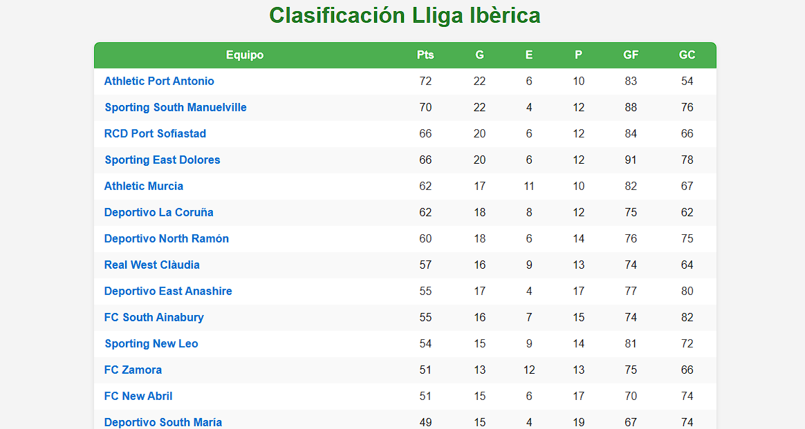
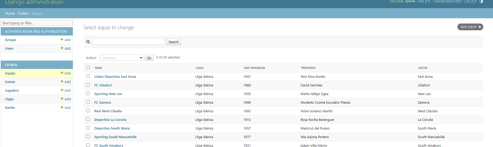

# ⚽ Liga-Fútbol – Gestión de Ligas con Django

> Plataforma web para administrar equipos, jugadores, partidos y clasificaciones.

> **Estado del proyecto:** 🧩 _En desarrollo_  
> Aplicación web construida con **Django** para gestionar una liga de fútbol: equipos, jugadores, partidos, resultados y clasificación general.



---

## 🧠 Descripción general

Este proyecto tiene como objetivo crear una **plataforma de administración de ligas de fútbol** donde los usuarios puedan:

- Registrar equipos, jugadores, partidos y eventos.
- Registrar resultados y generar clasificaciones automáticas.
- Consultar estadísticas de equipos y jugadores.

La aplicación está siendo desarrollada con **Django** (Python) como framework principal, utilizando **HTML, CSS y JavaScript** para la parte visual.

---

## 🚀 Objetivos del proyecto

- Practicar la estructura **Modelo–Vista–Controlador (MVC)** en Django.
- Implementar un sistema completo de **CRUD** (crear, leer, actualizar, eliminar).
- Trabajar con **relaciones entre modelos** (equipos ↔ jugadores ↔ partidos).
- Mejorar el diseño mediante **templates y estilos personalizados**.

---

### 📦 Requisitos previos

- Python >= 3.10
- Django >= 4.2
- pip >= 22
- (opcional) PostgreSQL o SQLite

---

## 🛠️ Tecnologías utilizadas

- **Python 3**
- **Django 4.2.18**
- **SQLite / PostgreSQL** (según entorno)
- **HTML5, CSS3, Bootstrap / Tailwind (por definir)**
- **Django Ninja** (para APIs)
- **Django CORS Headers**
- **Pillow** (para manejo de imágenes)

---

## 📥 Instalación y Configuración

Sigue estos pasos para descargar y ejecutar el proyecto localmente:

### 1. Clonar el repositorio

```bash
git clone https://github.com/PauGracia/Liga-Futbol.git
cd Liga-Futbol
```

### 2. Crear un entorno virtual (recomendado)

```bash
# En Windows
python -m venv venv
venv\Scripts\activate

# En macOS/Linux
python3 -m venv venv
source venv/bin/activate
```

### 3. Instalar dependencias

```bash
pip install -r requirements.txt
```

### 4. Configurar variables de entorno (si es necesario)

Crea un archivo `.env` en la raíz del proyecto si necesitas configurar:

- Claves secretas de Django
- Configuraciones de base de datos
- Otros ajustes específicos

### 5. Aplicar migraciones de la base de datos

```bash
python manage.py makemigrations
python manage.py migrate
```

### 6. Crear datos de ejemplo (liga, equipos y jugadores)

```bash
python manage.py crea_lliga "Nombre de tu Liga"
```

_Este comando creará una liga con equipos y jugadores de ejemplo para pruebas. Puedes crear más de una liga._

```bash
python manage.py borra_lliga "Nombre de tu Liga"
```

_Este comando eliminara la liga creada y todos sus datos._

Tambien puedes crear los datos manualmente en el panel Admin.

**Usuario:** `admin`  
**Contraseña:** `admin`



### 7. Crear un superusuario (opcional)

```bash
python manage.py createsuperuser
```

### 8. Ejecutar el servidor de desarrollo

```bash
python manage.py runserver
```

### 9. Acceder a la aplicación

Abre tu navegador y visita: `http://127.0.0.1:8000/`

---

## 📁 Estructura del proyecto

```
Liga-Futbol/
├── manage.py
├── requirements.txt
├── .env (opcional)
├── app_principal/          # App principal de la liga
│   ├── models.py          # Modelos de Equipo, Jugador, Partido, etc.
│   ├── views.py           # Vistas de la aplicación
│   ├── urls.py            # Rutas de la app
│   ├── management/
│   │   └── commands/
│   │       └── crea_lliga.py  # Comando para crear datos de ejemplo
│   └── templates/         # Plantillas HTML
└── config/                # Configuración del proyecto Django
    ├── settings.py
    ├── urls.py
    └── ...
```

---

## 🎯 Próximos pasos

- [ ] Definir estructura completa de modelos
- [ ] Implementar vistas CRUD para equipos y jugadores
- [ ] Diseñar interfaz de usuario
- [ ] Implementar sistema de clasificación automática
- [ ] Añadir estadísticas y reportes

---

## 📄 Licencia

Este proyecto es de código abierto y está disponible bajo la [Licencia MIT](LICENSE).
